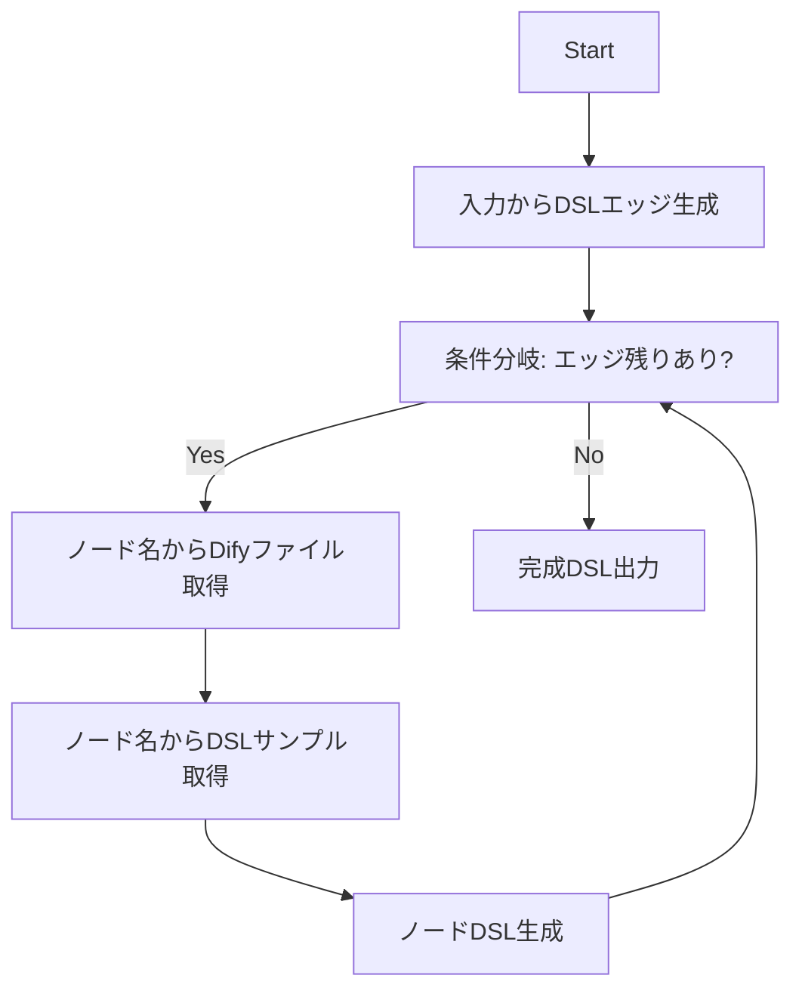

# このプロジェクトについて
このプロジェクトは DifyのDSLを自動生成するためのプロジェクトです。

## Difyワークフロー自動生成界隈の課題
世の中に公開されているDifyの自動生成プロジェクトはいくつかのノード情報と少々のToolを含んだ一発Promptになっています。
簡単なワークフローであればこれでも作成ができてしまうんですが、これだとDifyの能力を十全に生かしているとはいえません。
なぜなら本来のDifyはノードとツールを合わせると100近いノードがあり、これらの情報を全て一つのPromptに入れることは難しいからです。
もちろんGeminiのような2Mtokenにわたる情報をコンテキストに含めることが可能なLLMもありますが、精度が落ちていくためやはり難しいです。

またLLMにDifyのDSLyamlが事前学習されるのであれば、プロンプトに入れる必要もなくなるのですが

1. DSLの公式情報がDifyから出ていない
2. Difyは中国企業なのでOpenAIやClaudeに事前学習されにくい

というわけでDifyのDSLを事前学習したLLMは中国側から出てくることを祈るか自作するしかない状況です
https://huggingface.co/models?search=dify
現状(2025年1月3日現在)huggingface上にもDSLを事前学習したコード生成ものは見当たらず
DeepSeekなど有名どころの中国系LLMにも学習されていませんでした
そもそもDifyの開発速度が週に一度はリリースしたいと言ってるので、DSLを事前学習したLLMは毎週屑鉄になるので無しです。

## 本プロジェクトのアプローチ



1. ユーザー入力から計画を立ててエッジ部分だけまずは生成
2. エッジ上から舐めていきノード一個ずつに分解してループする
3. LOOP内では SubTaskが ノード名からノードの情報（ノードのソースコード、そこでimportされているソースコード、entity、テストコード、事前に用意したサンプルxml）を取得し出力
4. 4.で出力されたノードの情報から ノードのDSLを一つ分生成
5. 全てのエッジをなめるまで 2-4を繰り返す
6. 5で出力された一つ一つのノード.ymlと1で生成したエッジを統合して一つのDSL.yamlにする

## 本プロジェクトの問題点
ノード一つにつき1回APIを叩くのでAPI料金が高くなる。

## 問題点の解決方法
DeepSeek ならめっちゃやっすいいいい！！！！！！


というわけで普通に使う場合は DeepSeekありきの構成です。
もしくは4を飛ばして、全ての情報が集まってから必要な情報を全てまとめてo3に投げるのもありかもしれませんが
本Projectでは現状対象外です。

余談ですが、波浪の方でo1Proには全部まとめてぶんなげてみましたがダメでした。
まあソースコード含めてるのでちょっと量が多すぎるんですよね、o1Proにはもうちょっと情報を削減しないとだめだと思います。


## ライセンス
本プロジェクトはMITライセンスですがsrc/dify 以下はdifyのライセンス管理下です
```
src/
+ dify 
  +-- core/
  +-- models/
+ validation.py
```
上記はDifyのプロジェクトからコピーしたディレクトリや修正したファイルであり
本運用時は`init.sh` とかに`git clone`でも仕込むようにする予定
とりあえずLICENSEはきっちりおきまくってやりました！


